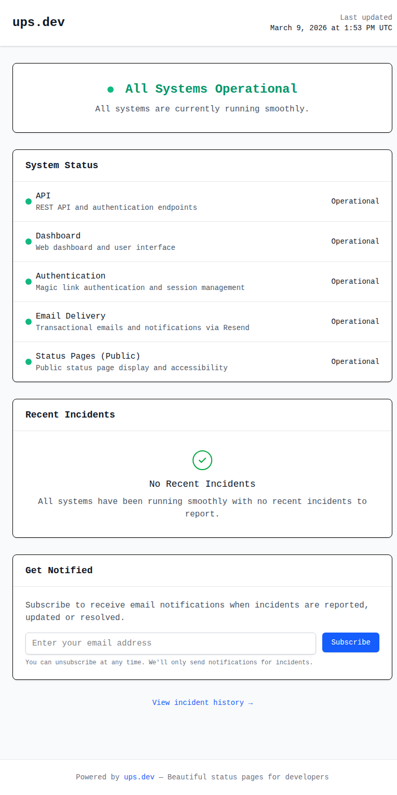

# ups

Modern status pages built with Rails 8 + SQLite.

<p align="center">
  
</p>

A complete, self-hostable status page platform for your web services, APIs, and infrastructure. Public status pages, incident management, subscriber notifications, synthetic monitoring, and a full REST API — all backed by SQLite.

**Don't want to self-host?** [ups.dev](https://ups.dev) runs the managed version — set up a status page in under 2 minutes. Free tier included.

[](LICENSE)
[](https://www.ruby-lang.org/)
[](https://rubyonrails.org/)

## Why ups?

Most status page tools are either expensive SaaS ($29-399/mo), abandoned open-source projects, or over-engineered for what should be a simple problem.

ups is a single Rails app with a SQLite database. No Redis, no Postgres, no external dependencies. Deploy it anywhere Docker runs.

| | ups (self-hosted) | Statuspage.io | Betteruptime |
|---|---|---|---|
| Price | Free | $29-399/mo | $20-85/mo |
| Self-hostable | Yes | No | No |
| Open source | Yes (AGPL-3.0) | No | No |
| Database | SQLite | Postgres | Unknown |
| Setup time | 5 minutes | 30 minutes | 15 minutes |

## Features

- **Status Pages** — Public, branded pages showing real-time component status
- **Components** — Track services with operational / degraded / partial outage / major outage / maintenance states
- **Incidents** — Create, update, and resolve incidents with full timeline history
- **Subscriber Notifications** — Email alerts when status changes or incidents are posted
- **Synthetic Monitoring** — HTTP/HTTPS/TCP health checks with configurable intervals
- **REST API** — Full CRUD with token authentication for programmatic management
- **MCP Server** — Model Context Protocol endpoint for AI agent integration
- **Webhooks** — Outbound webhook delivery for existing tooling
- **Real-time Updates** — Turbo Streams push changes to connected browsers
- **Multi-tenant** — Multiple accounts, status pages, and team members
- **Magic Link Auth** — Passwordless authentication via email

## Quick Start

### Docker (recommended)

```bash
docker run -d \
  -p 3000:3000 \
  -v ups_storage:/rails/storage \
  -e RAILS_MASTER_KEY=your-master-key \
  ghcr.io/codenamev/ups:latest
```

### Docker Compose

```yaml
# docker-compose.yml
services:
  ups:
    image: ghcr.io/codenamev/ups:latest
    ports:
      - "3000:3000"
    volumes:
      - ups_storage:/rails/storage
    environment:
      - RAILS_MASTER_KEY=${RAILS_MASTER_KEY}
      - HOST_URL=https://status.yourdomain.com
    restart: unless-stopped

volumes:
  ups_storage:
```

```bash
RAILS_MASTER_KEY=your-key docker compose up -d
```

### From Source

```bash
git clone https://github.com/codenamev/ups.git
cd ups
bundle install
bin/rails db:prepare
bin/rails server
```

Visit `http://localhost:3000`, create an account, and set up your first status page.

### Deploy with Kamal

```bash
cp config/deploy.yml.example config/deploy.yml
cp .kamal/secrets.example .kamal/secrets
# Edit both files with your server details
bin/kamal setup
```

## Tech Stack

- **Ruby 4.0.1** / **Rails 8.1**
- **SQLite** with Solid Queue, Solid Cache, and Solid Cable
- **Tailwind CSS** / **Turbo** / **Stimulus**
- **Kamal** for zero-downtime deployments
- **Resend** for transactional email (configurable)

## API

All endpoints require a Bearer token (create one in the dashboard under API Tokens).

```bash
# List components
curl -H "Authorization: Bearer YOUR_TOKEN" \
  https://your-instance.com/api/v1/status_pages/your-slug/components

# Report an incident
curl -X POST \
  -H "Authorization: Bearer YOUR_TOKEN" \
  -H "Content-Type: application/json" \
  -d '{"incident": {"title": "API Degradation", "impact": "minor"}}' \
  https://your-instance.com/api/v1/status_pages/your-slug/incidents
```

Discovery endpoint at `/api/v1` describes all available resources.

## MCP (Model Context Protocol)

ups includes an MCP server at `/mcp`, allowing AI agents to query and manage status pages programmatically. See the [ActionMCP docs](https://github.com/seuros/action_mcp) for client integration.

## Configuration

| Variable | Description | Default |
|----------|-------------|---------|
| `RAILS_MASTER_KEY` | Decrypts credentials | Required |
| `HOST_URL` | Public URL for email links | `http://localhost:3000` |
| `SOLID_QUEUE_IN_PUMA` | Run jobs in web process | `true` |
| `WEB_CONCURRENCY` | Puma worker count | `1` |

Email delivery is configured via Rails credentials (`bin/rails credentials:edit`).

## Managed Service

If you'd rather not deal with hosting, updates, backups, and SSL certificates, [ups.dev](https://ups.dev) runs the managed version with:

- Free tier (1 status page, 5 components)
- Automatic monitoring and alerting
- Managed SSL and CDN
- Email delivery included
- No infrastructure to maintain

**Self-hosters:** if you outgrow your setup, migrate to the managed service anytime.

## Contributing

Pull requests welcome. See [CONTRIBUTING.md](CONTRIBUTING.md) for guidelines.

## License

[AGPL-3.0](LICENSE) — self-host, modify, and distribute freely. If you offer ups as a hosted service, modifications must be open-sourced under AGPL-3.0.
